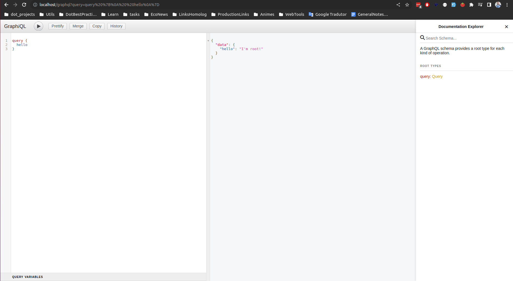

# GraphQL and Nodejs

Created by Gustavo Morais

```sh
```

```sh
apt install nodejs -y
apt install npm -y
npm init
npm i express express-graphql graphql nodemon
npm i --save-dev @babel/cli @babel/core @babel/node @babel/preset-env
```

### Start MongoDB service
```sh
systemctl start mongod
systemctl status mongod
```

### Basic index.js
```js
import express from 'express'
import { graphqlHTTP } from 'express-graphql';
import schema from './schema';

const app = express();

app.get('/', (req, res) => {
    res.send('GraphQL Study');
});

const root = { hello: () =>  "I'm root!"}

app.use('/graphql', graphqlHTTP({
    schema: schema,
    rootValue: root,
    graphiql: true
}));

app.listen(8080, () => console.log('Listen port 8080 for localhost/graphql'));
```

### Query get product
```js
query {
  getProduct(id: "") {
    id,
    name,
    price,
    description
  }
}
```

### Query get all products
```js
query {
  getAllProducts {
    id,
    name,
    description,
    price,
    inventory,
    soldout,
    stores {
      name
    }
  }
}
```

### Query Mutation Example
The second json object tells which data of the created object will be returned.
```js
mutation {
  createProduct(input: {
    name: "widget",
    description: "test",
    price: 1.3,
    soldout: SOLDOUT,
    stores: [
      {
        name:"asfasfdasdf"
      }
    ]
  }),
  {
    id,
    name,
    description,
    price,
    soldout
  }
}
```

### Update example
```js
mutation {
  updateProduct(input: {
    id: "653ad53d4a0ada3db33069d1",
    name: "asdfasdf",
    description: "asdfasfasdf",
    price: 13.3,
    soldout: SOLDOUT,
    stores: [
      {
        name:"asfasfdasdf"
      }
    ]
  }),
  {
    id,
    name,
    description,
    price,
    soldout
  }
}
```


