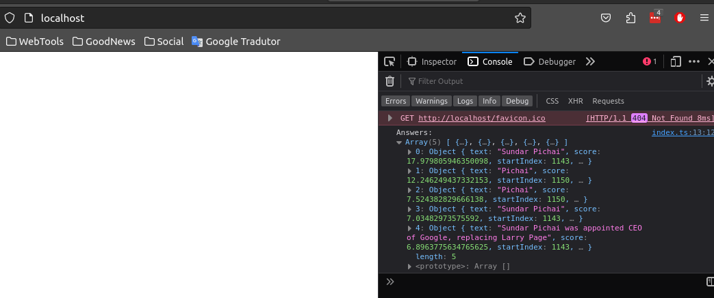

# JS Tensorflow Studies

Created by Gustavo Morais

- [xenova/transformers](https://www.npmjs.com/package/@xenova/transformers)

```sh
```

### Compile file with webpack
To build the main.js file without npm run
```sh
npx webpack --config webpack.config.js
```
### Compile with npm
```sh
npm run build
```
### Run webpack server
```sh
npx webpack serve
```
### tfjs model qna answer

